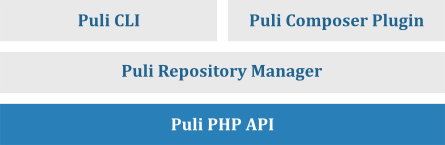

The Puli Components
===================

Puli consists of four core components:

A summary of each component is given below.

The PHP API
-----------

The `Puli`_ package contains a PHP API for managing *resource repositories* that
map *Puli paths* to physical paths on the file system:

.. code-block:: php

    use Puli\Repository\ResourceRepository;

    $repo = new ResourceRepository();
    $repo->add('/app', '/path/to/project/res');

    echo $repo->get('/app/views/index.html')->getContents();

:doc:`repositories` explains in detail how to create resource repositories
by hand.

The Package Manager
-------------------

The `Puli Package Manager`_ manages a resource repository using puli.json
files in the root directory of your project and any installed packages:

.. code-block:: json

    {
        "resources": {
            "/app": "res"
        }
    }

In :doc:`repository-configuration` you will learn all about mapping resources
in puli.json files.

The Command Line Interface
--------------------------

The `Puli CLI`_ is a command line interface to the package manager. The most
important command is ``puli dump``, which generates the managed resource
repository as a PHP file:

.. code-block:: bash

    $ puli dump

The generated file can be loaded in your PHP code:

.. code-block:: php

    $repo = require __DIR__.'/.puli/resource-repository.php';

    echo $repo->get('/app/views/index.html')->getContents();

The Composer Plugin
-------------------

The `Composer Plugin`_ for Puli integrates Composer into the package manager.
With this plugin, the puli.json files of all installed Composer packages are
loaded into the resource repository. For example, if the Composer package
"acme/blog" maps resources to the Puli path ``/acme/blog``, you can access
these resources like so:

    .. code-block:: php

        echo $repo->get('/acme/blog/views/post.html')->getContents();

Further Reading
---------------

Read :doc:`getting-started` to learn how to install Puli and use it in your
project.

.. _Puli: https://github.com/puli/puli
.. _Composer: https://getcomposer.org
.. _Puli Package Manager: https://github.com/puli/puli-package-manager
.. _Puli CLI: https://github.com/puli/puli-cli
.. _Composer Plugin: https://github.com/puli/puli-composer-plugin
